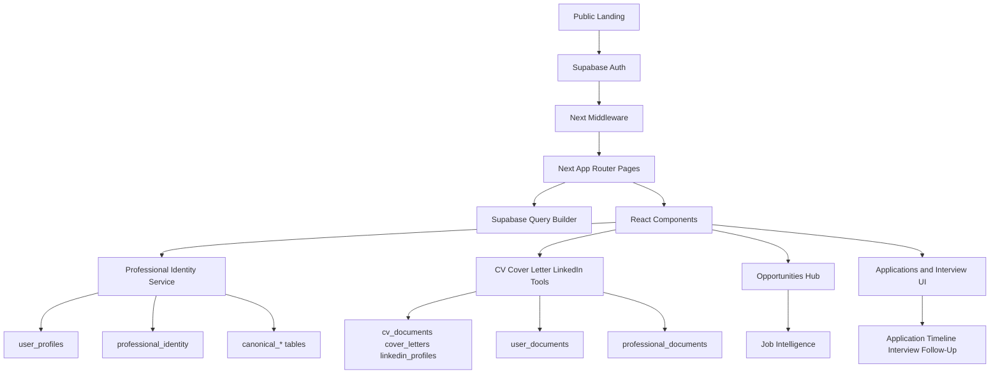
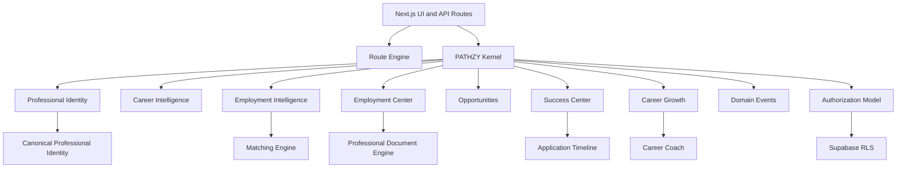
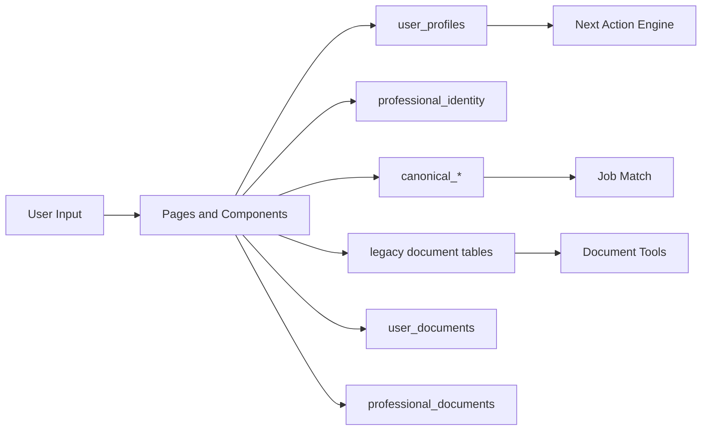
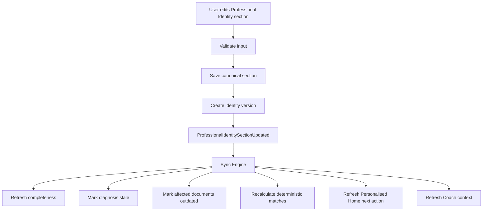
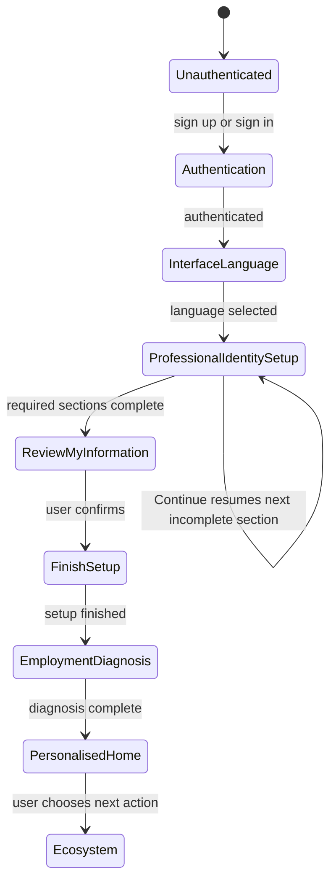
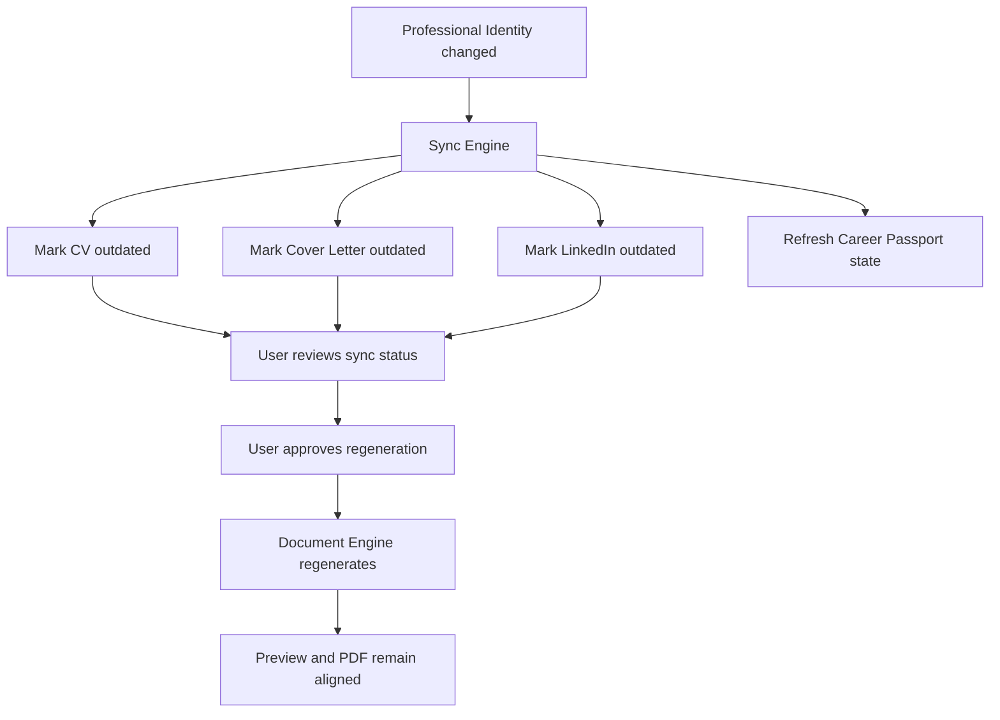
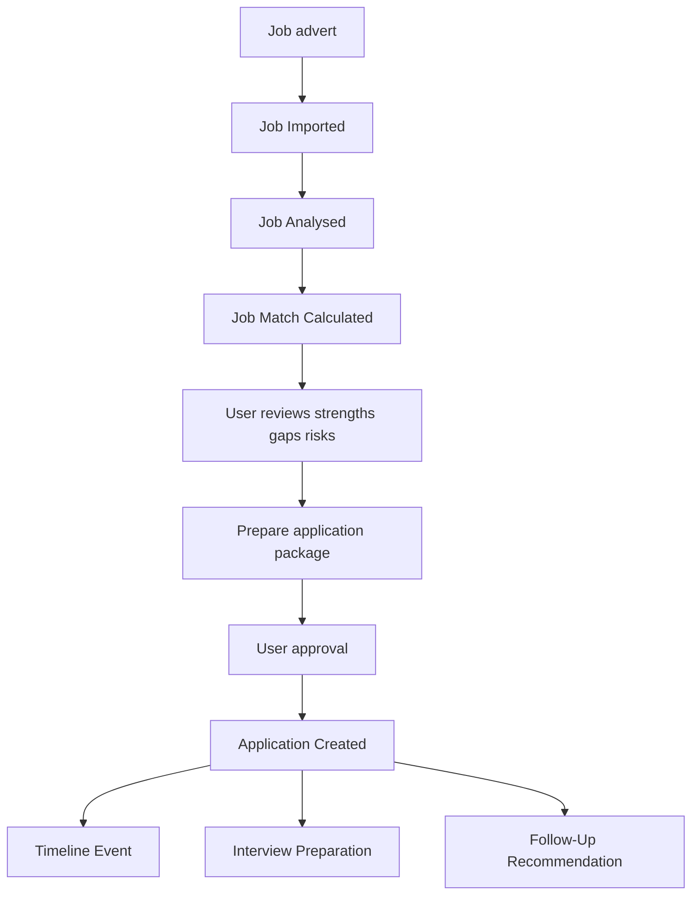
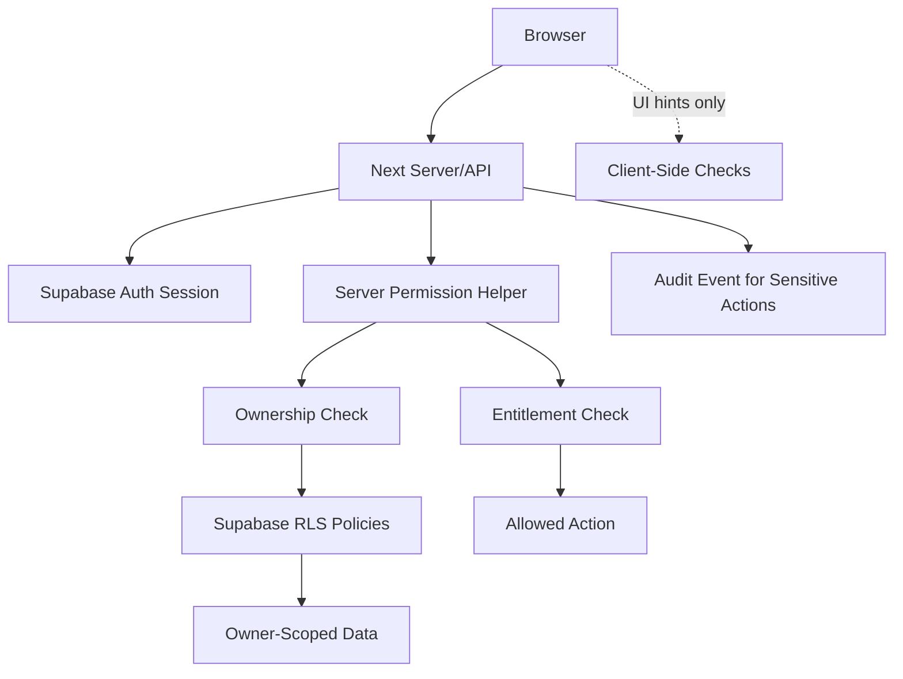

# PATHZY Platform Dependency Map

Status: Phase 1.5 blueprint
Created: 2026-07-28

These diagrams describe architecture direction only. They do not add runtime dependencies.

## 1. Current Architecture

## 2. Target Modular Architecture

## 3. Current Data Flow

## 4. Target Professional Identity Update Flow

## 5. Onboarding Route State Machine

## 6. Document Synchronization Flow

## 7. Job-to-Application Workflow

## 8. Authorization Boundaries

## Diagram Assumptions

- Mermaid is rendered by GitHub Markdown; no runtime dependency is required.
- Diagrams describe intended architecture, not current implementation guarantees.
- Current architecture diagrams are simplified from Phase 0 evidence.
